# 数学建模 Skill × 60 图高级图表库

一个面向大学生、研究生数学建模竞赛的开源工具包。仓库把两类能力放在同一套可执行流程里：`cpmcm-modeling-coach` 负责从赛题理解、条件确认、方法选择、代码与验证到成稿终检；60 图高级图表库负责根据真实结果选择合适图形，并提供数据要求、效果预览和可复现 Python 代码。

本项目不是“万能模板合集”，也不是把示例图直接换标题。它强调先取得真实题面和数据，明确需要支持的结论，再选择模型和图表；程序能够运行、数值能够重算、科学结论能够成立，是三个不同层级。


## 这个项目解决什么问题

数学建模任务常见的问题并不是缺少算法名称，而是流程不完整：题面与附件没有读全就开始求解，模型与数据结构不匹配，调参和评价发生数据泄漏，优化模型漏掉硬约束，正文数字无法回到结果文件，图表好看但不能支持结论，最后检查只看文件是否存在而没有检查证据链。

本仓库将这些问题拆成一条可审计工作流：

```text
真实赛题与附件
    -> 前置条件问询与启动状态门
    -> 问题画像、子问题拆分和方法路由
    -> 数据处理、模型实现与验证
    -> 机器可读结果和关键数值复核
    -> 图表证据契约与模板匹配
    -> 写作、独立复审与定向修订
    -> 35 项交付前终检
```

只有题面、附件、交付形式、目标篇幅、写作侧重、时间和算力等条件得到明确确认后，Skill 才会进入正式执行，避免信息不足时直接套用默认方案。

## 仓库包含什么

| 模块 | 内容 | 用途 |
| --- | --- | --- |
| `skill/cpmcm-modeling-coach` | Skill 主体、方法路由、写作规范、审计规则、模板和脚本 | 组织完整建模流程，并在关键步骤设置检查门 |
| `chart-gallery/library` | 60 个图表条目、60 张完整预览、60 张缩略图 | 按数据结构、主张和验证条件选择图表 |
| `chart-gallery/src` | PySide6 图表浏览器源码 | 浏览、搜索、筛选并复制模板代码 |
| `docs/iteration-history` | v0.1—v0.8.1 公开迭代记录 | 说明每一版新增能力和问题来源 |
| `PROMPTS.md` | 安装、联动使用和继续迭代提示词 | 让支持本地文件和自定义 Skill 的智能体协助部署 |
| GitHub Release | Windows 独立 EXE 与完整压缩包 | 不安装 Python 也能浏览图表库 |

开源版还保留了33篇匿名化结构化精读笔记，用于方法定位、验证协议和风险提示；不包含论文原文、赛题附件或培训课件。笔记不能代替原文，核验引用、页码、公式或结论时仍须读取合法获得的原始材料。

## Skill 的主要能力

- **主动前置问询**：首轮集中确认题面、附件、比赛规范、交付物、篇幅、风格、重点、时间和算力；关键条件没有确认时暂停正式任务。
- **基于问题结构选模**：先冻结任务目标、独立数据单位、时间/空间结构、不确定性、硬约束、可评价真值和计算预算，再选择透明基线、主方案及必要备选方案。
- **数据与验证审计**：检查时间泄漏、同对象切片泄漏、插补与缩放边界、阈值选择、嵌套验证、类别先验、统计定义和不确定性传播。
- **优化完整性检查**：区分题面硬约束与自建偏好，检查容量、预算、守恒、供需缺口、并列解、定价、选址、调度以及上下游结果失效传播。
- **多类方法路由**：覆盖预测与分类、多元统计、模糊与灰色方法、多属性决策、随机过程与随机规划、图网络、动力系统、最优控制、纵向与生存分析、PDE 数值方法及空间建模等方向。
- **结果与图表可追溯**：关键数字来自机器可读结果；每张主图登记源字段、数据变换、生成脚本、模板、关键断言和正文引用位置。
- **写作与独立复审**：规范摘要、问题重述、假设、符号、模型、验证、参考文献和篇幅扩写；冻结初稿后进行独立评价、问题分级和定向返修。
- **35 项终检**：覆盖题面落实、数据语义、模型选择、验证边界、优化约束、图文一致、引用质量、源码交付、逐页视觉检查和独立复审证据。

35 项清单见 [`final-audit-checklist.md`](skill/cpmcm-modeling-coach/assets/final-audit-checklist.md)。

### 完整35项终检规则

1. 每个子问题都有明确输入、模型、输出、验证和交付物。
2. 每个子问题已形成任务目标、数据结构、不确定性、约束和证据预算的五维画像；选模不是算法名清单。
3. 启动状态门已完成：首轮在问题后停止；真实题面与必要附件可读；正文页数、交付范围、风格和重点等已有用户明确回答，或有用户亲自回复“默认/全部默认”的证据。未回答不能视作默认。
4. 任务简报已显式登记“数学建模竞赛、参赛者/参赛队、竞赛评委”背景，全文体裁和取舍面向竞赛论文。
5. 当届题面、更正、格式规范、单位、符号和约束全部落实。
6. 样本单位、数据语义与观察过程、信息时点和评价四份契约已冻结；标签层级、动态变量和事件发生/观察时间没有混用。
7. 插补、异常处置、记忆污染区间、缩放、筛选、重采样和调参均在训练边界内；数据切分符合真实使用方式。
8. 阈值、组数和切点的选择与最终评价已隔离；若未隔离，指标和显著性已明确降级为选择后/探索性结果。
9. 透明基线、消融、敏感性、不确定性和失败条件足以支撑模型选择。
10. 主方案的适用前提有数据或题意证据；权重、隶属函数、标准化、成分/簇数、分布、情景和图权重等方法特有选择可追溯，失败时已按预设条件切换或降级。
11. 动力学/优化先通过可达性与约束可行性；弱识别控制量通过支持域和跨情景稳健性检查。
12. 优化模型的硬约束、定义、原始目标与补充假设已分开登记；假设没有取消容量、预算、守恒、边界或题面规定的选择机制，收入/补贴只基于实际可服务量。
13. 最优性或交叉验证模型与主体模型的变量、约束和目标范围匹配；若只验证松弛上界或子问题，正文已明确限制。
14. 若控制变量进入优化，预测优化门与现实行动门已分别核验；固定比例扰动未被包装成完整不确定性证明。
15. 小问存在依赖时，下游代码真实加载版本化接口工件，Schema、单位、来源、版本和有效域一致。
16. 每张主图/主表可从机器可读结果和生成脚本重建，图例、单位、统计口径与正文一致。
17. 每张主图已登记图表证据契约；源字段、过滤/聚合/标准化/分箱等变换、模板验证状态、生成脚本、输出和关键断言均可追溯，图库合成示例未混入正式结果。
18. 每张图表先被正文引用并有实质解释；没有连续堆叠三张以上互不构成同一比较任务的图表；图表和表格没有无角色重复。
19. Pareto、可行域、寻优路径、校准、空间热点、尾部风险和累积归因等高级图已满足各自证据门槛；图形复杂度没有被当作模型有效性证据。
20. 正文中的每个关键数值、区间、极值、排序和百分比已从源结果字段重新计算或由断言核对，不凭图形目测抄写。
21. 会改变主结论的少量核心统计量已从定义、真实标签和冻结结果，用不同实现、标准库或解析恒等式独立复核；未导入、复制或改名复用原评价函数，内部一致性没有被写成科学验证。
22. 特征、阈值、切点、模型和超参数的完整选择过程进入外层评价；若没有，OOF/检验已降级为探索性。嵌套对照复现的是相同选择规则，而非另一种替代规则。
23. 类别先验或概率校正已核验抽样机制、模型概率含义和标签偏移假设；固定预测bootstrap、重新拟合、重复切分与模型选择不确定性没有混写。
24. 因果、预测、观测方向、仿真和模型内情景语言没有混淆；负结果没有被隐藏。
25. 题面要求的核心输入与为实时预测加入的历史/状态扩展输入已分开说明，并报告核心变量增量贡献。
26. 正文使用公式/流程图/必要伪代码说明算法，完整源代码位于论文PDF之外；PDF附录只列源码清单、入口、依赖、输入输出与复现步骤。
27. 正式源码脚本覆盖全部交付工件；无临时命令生成的无主工件；主表和正文关键数字由机器可读结果程序化生成而非手抄。
28. “折内、嵌套、独立测试、外部验证”等任务契约声明已逐条与实际代码实现核对。
29. 程序运行、内部重算、外部数值复现和科学验证被分别表述，并列出阻止升级的条件。
30. 所有数值、引用、结论、AI使用和最终提交文件均可追溯且符合匿名/格式要求。
31. 完整论文参考文献达到覆盖门且默认不少于15篇；每篇正文实际使用并覆盖领域、核心方法、评价、数据/标准和软件来源，无凑数来源。
32. 正文页数按摘要至结论/模型评价统计，不含封面、目录、参考文献、附录和源码；若初稿不足已建立缺口矩阵并完成第二轮证据型扩写，仍不足则有用户接受短稿或授权新增实验的记录。
33. 最终HTML/文本层与逐页渲染未出现 `undefined`、`NaN`、`TODO`、占位标题、错误资料标签、重复编号或未解释的数值/结论矛盾。
34. 最终PDF已逐页视觉检查图表堆叠、裁切、遮挡、字号、跨页、残留Markdown和图文对应；文件存在、HTML标签数或PDF对象数未被当作视觉通过证据。
35. 冻结初稿已由未参与生成的子智能体按真实题面独立评审；评审者自行选择3—5篇相似优秀论文并记录页码，分别给工程复现分、科学有效性分和综合分；P0/P1处置、受影响结果全链重跑和修订后定向复核均有记录。环境不支持子智能体时已明确标注仅作者自审。

## Skill 文件与迭代过程展示

下面的截图展示 Skill 的参考规则、公开迭代记录和自迭代工具。赛题目录及优秀论文文件路径截图不放入开源介绍；仓库内也不提供对应第三方原始文件。

| Skill 参考规则 | 迭代记录概要 |
| :---: | :---: |
| 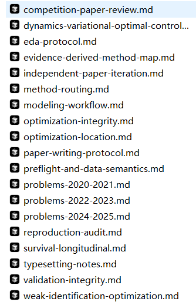 | 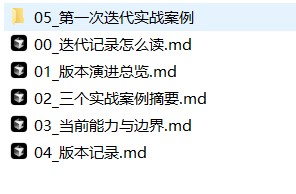 |

| 完整版本演进记录 | 继续迭代所需模板 |
| :---: | :---: |
| 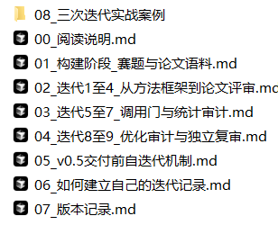 | 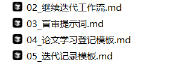 |

### 三次真实迭代的阶段性效果

以下截图保留三轮真实赛题测试时的阶段性成品首页，用于说明 Skill 如何经过“实际调用—过程审计—独立评价—规则修订”逐轮完善。它们不是官方优秀成果、获奖证明或标准答案，完整赛题、附件及成品文件不在本开源仓库中分发。

| 第一轮迭代 | 第二轮迭代 | 第三轮迭代 |
| :---: | :---: | :---: |
| 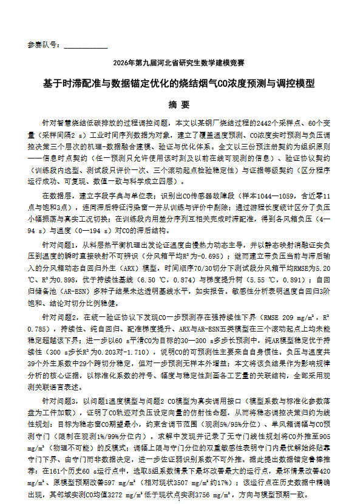 | 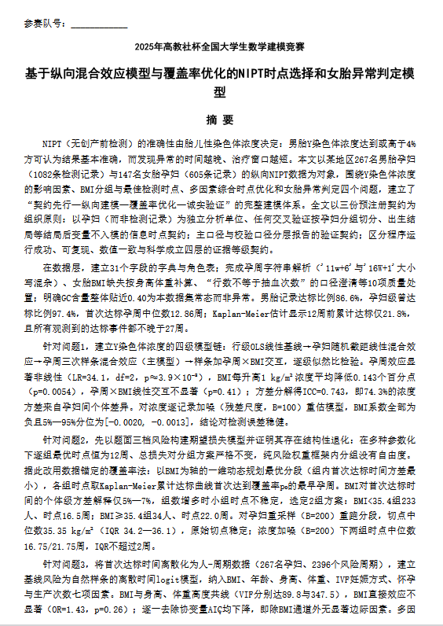 | 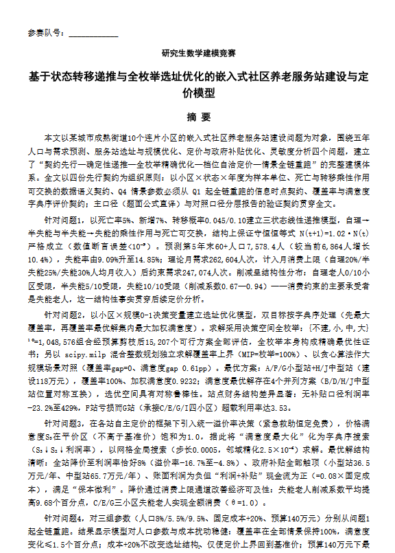 |

## 60 图高级图表库

每个图表条目不是一张孤立图片，而是一份可复现模板，包含适用问题、需要的数据字段、图形编码、误用风险、完整代码、效果图和缩略图。正式使用时必须以本题真实数据替换全部合成示例，并检查单位、图例、统计口径和正文结论是否一致。

| 研究设计与因果结构 | 预测与不确定性 |
| :---: | :---: |
| 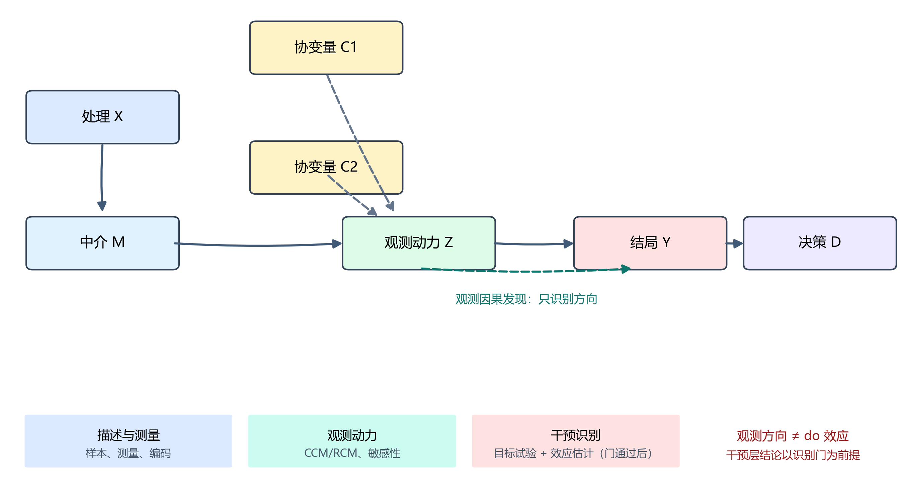 | 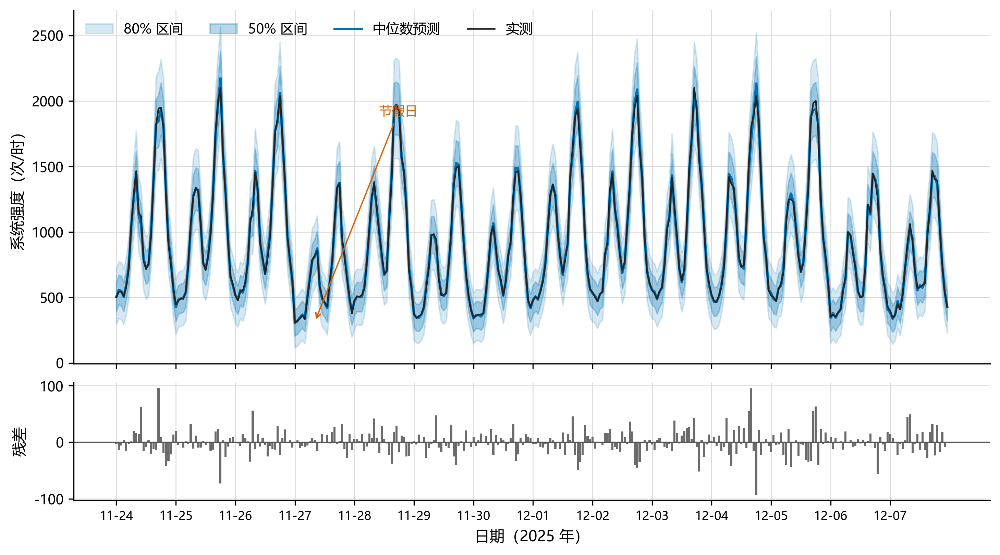 |
| **研究设计 DAG 图** | **预测扇形图** |

| 多目标优化 | 空间分析 |
| :---: | :---: |
| 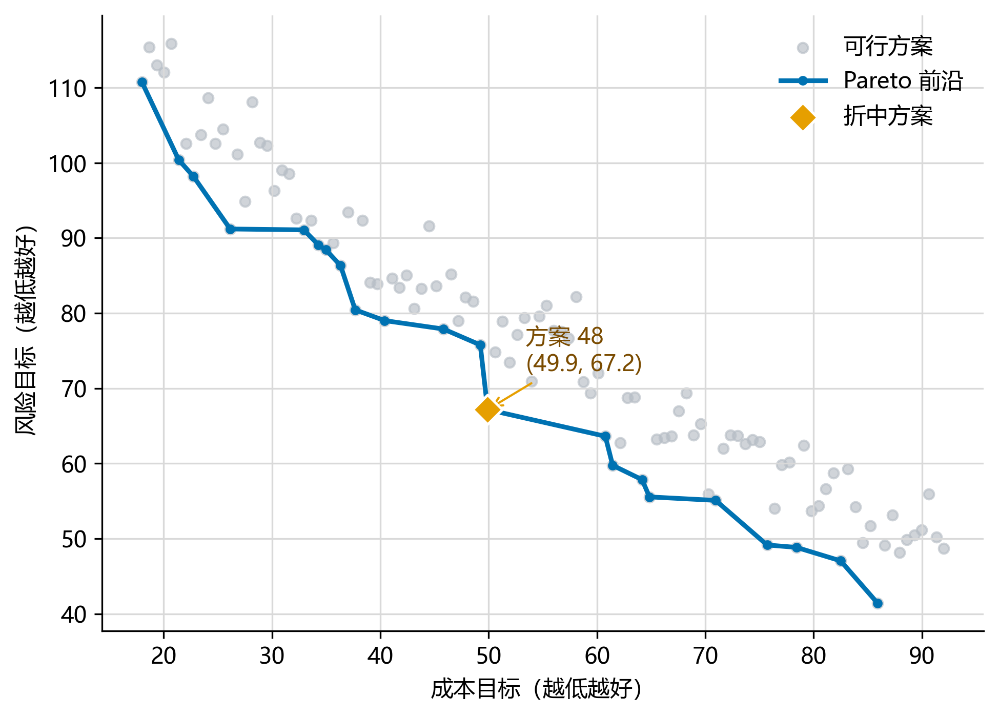 | 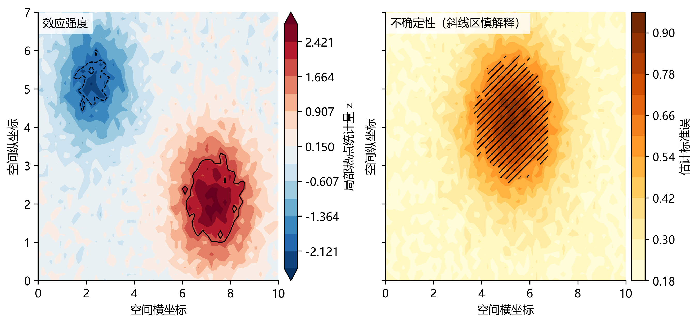 |
| **Pareto 权衡前沿** | **空间热点与不确定性** |

| 模型校准 | 可解释性诊断 |
| :---: | :---: |
| 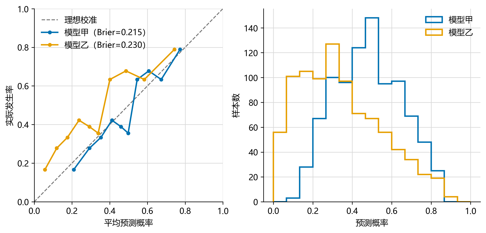 | 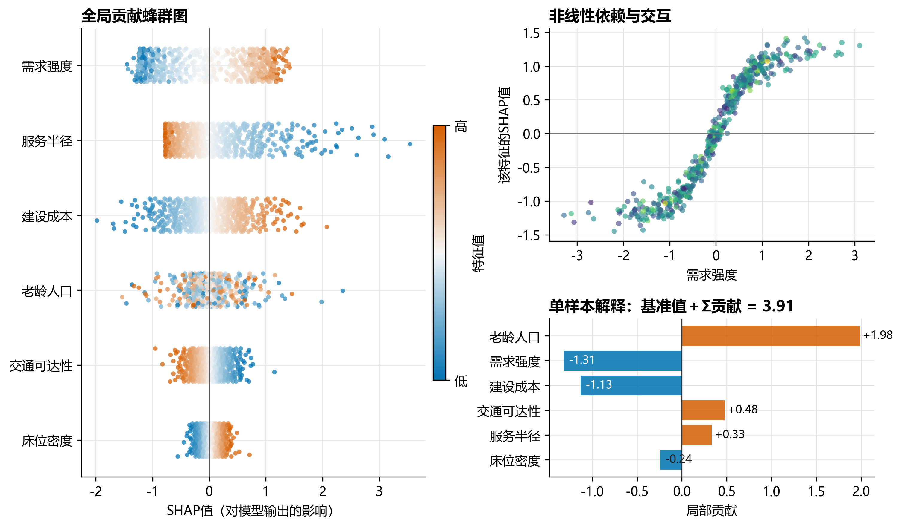 |
| **可靠性校准双面板** | **SHAP 解释诊断面板** |

| 时域与频域分析 | 调度与资源占用 |
| :---: | :---: |
| 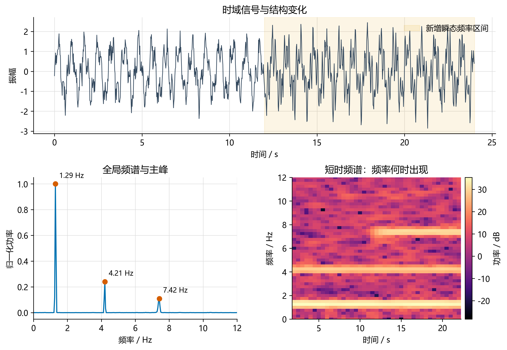 | 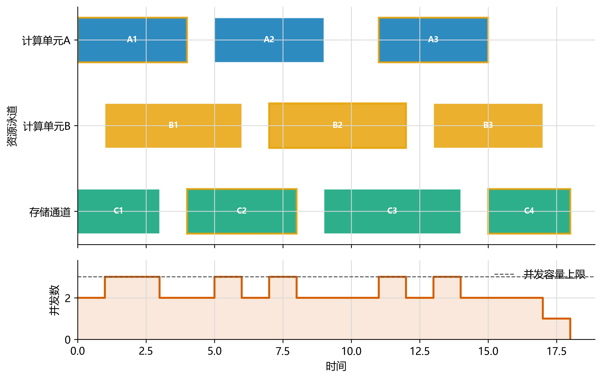 |
| **时域频域峰值诊断** | **甘特调度与资源占用** |

图表遵循“最小充分”原则：普通图能清楚回答问题时，不为了视觉复杂度强行升级；Pareto 前沿、可行域、校准、空间热点、SHAP、归因和风险图等模板，只有满足相应的数据与统计条件时才能使用。

## 快速开始

### 1. 下载完整包

Windows 用户可直接从 [Releases](https://github.com/1514173072/math-modeling-skill-chart-gallery/releases) 下载 `v0.8.1-open`，解压后运行：

```text
chart-gallery/MathModelingChartGallery.exe
```

EXE 只用于浏览、筛选和复制模板代码，不联网调用模型，也不需要本地 Python 环境。

### 2. 安装 Skill

将 `skill/cpmcm-modeling-coach` 整个文件夹复制到智能体的 Skills 目录。Codex 的常见位置为：

```text
C:\Users\你的用户名\.codex\skills\cpmcm-modeling-coach
```

也可以把仓库地址和以下要求直接交给支持本地文件与自定义 Skill 的智能体：

```text
请下载该仓库，将 skill/cpmcm-modeling-coach 安装到当前智能体的 Skills 目录，
检查 SKILL.md、references、scripts 和 assets 是否完整，并运行 Skill 校验。
图表库保留在仓库的 chart-gallery/library；使用数学建模 Skill 选图时，
同时检索该目录中的数据契约、误用条件和模板代码。
```

### 3. 从源码运行图表浏览器

```powershell
python -m pip install -r chart-gallery/requirements.txt
python chart-gallery/portable_run.py
```

### 4. 联动调用

```text
请使用 $cpmcm-modeling-coach 处理本次数学建模任务。
完成数据分析并形成真实机器可读结果后，检索 chart-gallery/library 中的图表条目：
根据子问题、字段、单位、样本结构和需要支持的结论筛选匹配模板，
再用本题真实结果替换全部合成数据。每张图说明用途、数据来源、
图形编码、验证方式和正文引用位置；不满足数据契约的模板不要使用。
```

更多现成提示词见 [PROMPTS.md](PROMPTS.md)。

## 版本迭代日志

当前开源版本为 `v0.8.1-open`。迭代对象是 Skill 的指令、流程、方法路由、模板和检查规则，不是修改任何基础模型参数。

- **v0.1 基础流程**：建立审题、模型选择、代码、验证、写作和资料检索流程。
- **v0.2 方法与写作**：增强探索性分析、动力系统、变分法、最优控制和弱识别优化能力。
- **v0.3 质量评价**：加入优秀成果基准思路，明确区分程序运行、数值复现和科学有效性。
- **v0.4 数据与验证**：增加主动前置问询、数据语义、纵向与生存分析、嵌套验证和关键数值复核。
- **v0.4.1 启动状态门**：条件未确认时必须暂停，避免直接套用默认模板。
- **v0.4.2 优化完整性**：增加硬约束、供需缺口、错误传播、并列解、选址、容量和定价检查。
- **v0.5 独立复审**：候选成品完成后先独立审阅，再从模型、代码和结果源头修复。
- **v0.6 多方法路由**：增加模糊与灰色方法、多属性决策、多元统计、随机过程、MCMC、随机规划和图网络。
- **v0.7 高级图表**：增加图表路由和证据契约，要求先有真实结果，再选择匹配模板。
- **v0.8 成品质量**：规范证据型扩写、通用章节、图表排布、语言、参考文献和源码交付。
- **v0.8.1 PDE 与空间建模**：增加偏微分方程数值求解、网格与残差验证、空间几何、合法路径和多模态空间评价。
- **v0.8.1-open 开源整理**：移除第三方原始材料、个人路径和商业交付信息；公开60图浏览器源码、Windows完整包、安装提示词和脱敏迭代记录。

更详细的阶段记录见 [`docs/iteration-history`](docs/iteration-history)。

## 项目结构

```text
math-modeling-skill-chart-gallery/
├─ skill/cpmcm-modeling-coach/    数学建模 Skill
├─ chart-gallery/
│  ├─ library/                    60 个图表条目、预览和缩略图
│  ├─ src/chart_gallery/          图表浏览器源码
│  ├─ scripts/                    图表库校验脚本
│  └─ portable_run.py             源码启动入口
├─ docs/iteration-history/        公开版迭代记录
├─ docs/images/                   README 展示图
├─ PROMPTS.md                     部署、联动和迭代提示词
└─ NOTICE.md                      内容来源与权利说明
```

## 本地校验

```powershell
python skill/cpmcm-modeling-coach/scripts/validate_corpus.py
python chart-gallery/scripts/verify_gallery.py
python chart-gallery/portable_run.py --smoke-test
```

当前发布前检查结果：Skill 结构校验通过；60/60 图表能够复现；Release 解压后包含60个条目、60张完整图、60张缩略图和可启动的 Windows EXE。

## 使用边界与内容说明

本项目用于辅助审题、建模、验证、表达和质量检查，不保证比赛结果。模型输出、代码、数值、图表、引用和赛事合规性仍需使用者最终核验。使用生成式人工智能时，应遵守对应赛事关于工具使用、披露和学术诚信的规定。

仓库不提供第三方论文原文、赛题附件、培训课件或真实案例成品。结构化笔记仅用于方法定位和审阅提示，不代表第三方作品授权。详细说明见 [NOTICE.md](NOTICE.md)。

## 开源与贡献

原创代码与文本采用 [MIT License](LICENSE) 开源。欢迎通过 Issue 反馈启动流程、方法路由、图表契约、代码复现或文档问题；新增图表应同时提供适用场景、数据要求、误用风险、可运行代码、完整预览和缩略图，并通过现有校验脚本。

贡献规范见 [CONTRIBUTING.md](CONTRIBUTING.md)，安全问题请参考 [SECURITY.md](SECURITY.md)。
