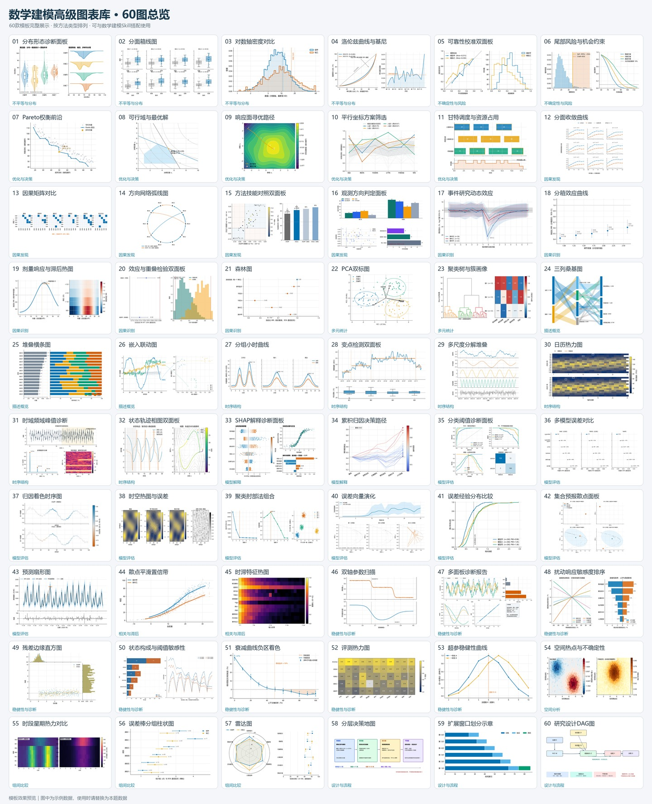

# 数学建模 Skill × 60图高级图表库

这是一个面向大学生和研究生数学建模竞赛的开源工具包，包含可安装的 `cpmcm-modeling-coach` Skill，以及60个带数据契约、效果预览和可复现Python代码的图表模板。



## 包含内容

- `skill/cpmcm-modeling-coach`：从审题、前置问询、方法选择、求解验证到写作与终检的建模工作流。
- `chart-gallery/library`：60个图表条目，每项包含Markdown说明、完整预览、缩略图和可执行代码。
- `chart-gallery/src`：图表浏览器的PySide6源代码，不包含联网AI模块或任何凭据。
- `docs/iteration-history`：v0.1至v0.8.1的公开迭代记录。
- GitHub Release：Windows免Python浏览包及完整ZIP。

## 安装 Skill

将 `skill/cpmcm-modeling-coach` 整个文件夹复制到智能体的 Skills 目录。Codex默认位置为：

```text
C:\Users\你的用户名\.codex\skills\cpmcm-modeling-coach
```

也可以把仓库地址和下面的要求直接发给支持本地文件与自定义Skill的智能体：

```text
请下载该仓库，将 skill/cpmcm-modeling-coach 安装到当前智能体的 Skills 目录，
检查 SKILL.md、references、scripts 和 assets 是否完整，并运行 Skill 校验。
图表库保持在仓库的 chart-gallery/library，不要复制进 Skill；
使用数学建模 Skill 选图时，同时检索该目录中的图表数据契约和模板代码。
```

安装后可使用 `$cpmcm-modeling-coach` 发起任务。Skill首次进入任务时会先确认题面、附件、赛事规范、交付物、篇幅、风格、重点、时间与算力条件；关键条件未确认时暂停正式建模。

## 使用图表库

优先从 [Releases](https://github.com/1514173072/math-modeling-skill-chart-gallery/releases) 下载 Windows 完整包，解压后运行 `MathModelingChartGallery.exe`。EXE 只负责浏览、筛选和复制代码，模板数据均为合成示例。

从源码运行：

```powershell
python -m pip install -r chart-gallery/requirements.txt
python chart-gallery/portable_run.py
```

正式使用时应遵循：

```text
真实题目与数据 -> 明确需要证明的结论 -> 匹配数据契约 -> 选择最简单充分的图 ->
替换全部示例数据 -> 执行代码 -> 核对图文、单位和结论 -> 保存代码与结果
```

预览图不能直接作为竞赛结果使用，也不应先选“好看”的图再倒推数据。

## Skill与图表库联动提示词

```text
请使用 $cpmcm-modeling-coach 处理本次数学建模任务。
完成数据分析并形成真实机器可读结果后，检索 chart-gallery/library 中的图表条目：
先根据子问题、字段、单位、样本结构和需要支持的结论筛选数据契约匹配的模板，
再用本题真实结果替换模板中的全部合成数据。每张图必须说明用途、数据来源、
图形编码、验证方式和正文引用位置；不匹配的模板不要使用。
```

## 校验

```powershell
python skill/cpmcm-modeling-coach/scripts/validate_corpus.py
python chart-gallery/scripts/verify_gallery.py
python chart-gallery/portable_run.py --smoke-test
```

Skill结构还可使用Codex自带的 `quick_validate.py` 校验。

## 使用边界

本项目用于辅助审题、建模、验证、表达和质量检查，不提供获奖保证。模型输出、代码、数值、图表、引用和赛事合规性仍需参赛者最终核验。使用生成式人工智能时，应遵守对应赛事关于工具使用、披露和学术诚信的规定。

仓库不提供第三方论文原文、赛题附件或培训课件。详细权利边界见 [NOTICE.md](NOTICE.md)。

## 许可证

原创代码与文本采用 [MIT License](LICENSE) 开源。
